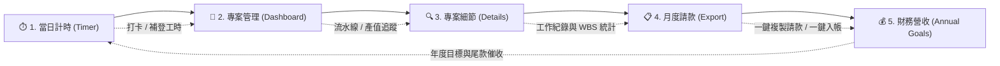

# ⏱️ WorkTime Pro | 自由工作者與接案顧問的本地工時與營收追蹤系統

> **Local-First & Privacy-Focused Time, Billing & Revenue Management Tool**  
> 一款專為自由工作者（Freelancers）、獨立顧問（Consultants）與外包設計師打造的**本機優先（Local-First）**工時記錄、客戶對帳請款與年度財務管理工具。

---

## 🌟 核心理念與特色

- 🛡️ **100% 隱私與資料本地化（Local-First）**  
  所有專案、工時明細與財務紀錄皆儲存在您本機的 `~/Documents/TimeTrackerData.json`。零雲端上傳、不依賴外部資料庫、零連網 API 額度消耗，即便在無網路環境下也能順暢使用。
- ⏱️ **流暢計時與智慧工作分類（Smart Taxonomy）**  
  支援即時碼錶打卡、手動補登工時，並內建智能關鍵字辨識（如研究、訪談、文案、會議、開發等），自動歸類工作性質與專案 WBS 子項目。
- 💼 **雙軌計費模式（Dual Billing Engine）**  
  - **計時專案（Hourly）**：依實際投入工時自動換算累計產值（預設 $0/h），無合約欠款負擔。
  - **固定總額專案（Fixed Contract）**：依合約總金額追蹤各期入帳進度、實質時薪與尚欠尾款。
- 📋 **時間軸月度請款與對帳中心（Timeline Billing Statement）**  
  按月份與發款客戶，依**時間軸流水帳（由先到後）**一鍵彙整每日工作紀錄，支援**一鍵複製請款文字（直接貼到 LINE / Email）**與**一鍵月薪登記入帳**。
- 📊 **年度財務目標與客戶金流看板（Annual Goals & Cashflow）**  
  即時視覺化年度達標進度、主要客戶營收排名、尾款收齊狀態，並支援全站多標籤**靈活複選篩選（Multi-Select Filter）**。
- 🚀 **極簡啟動（One-Click Launch）**  
  Mac 用戶雙擊 `WorkTime.command` 即可於 1 秒內在背景啟動本地輕量伺服器並自動開啟網頁。

---

## 🔄 使用者操作流程（User Flow）



### 1. 每日日常：當日計時（Timer）
1. 進入首頁，由全站統一選單挑選正在進行的專案。
2. 點擊「開始計時」或輸入時數手動補登。
3. 系統自動依工作描述關鍵字匹配工作性質標籤（如 `🎤 訪談`、`🛠️ 架構規劃`）。

### 2. 專案綜覽：專案儀表板（Dashboard）
1. 透過頂部「狀態流水線」即時掌握 **🟢 執行中**、**💡 提案/開拓中**、**🚨 待請款** 專案（支援多標籤同時勾選）。
2. 卡片即時呈現：累計工時、產值（計時案）或已收款項（固定案）、實質時薪。

### 3. 深化分析：專案細節與 WBS（Project Details）
1. 查看該專案的累計工時柱狀圖與每日明細。
2. 自動萃取動態任務主題聚類（WBS Breakdown），作為未來向客戶提案與報價的工時基準。

### 4. 月底結算：月度請款與對帳中心（Export）
1. 選擇發款客戶與結算月份（例如 `2026-03`）。
2. 系統自動產出**依時間軸排序**的工作流水帳與各專案時數小計。
3. 點擊 **【📋 一鍵複製請款文字】** ➔ 直接發送給客戶對帳。
4. 款項入帳後點擊 **【✅ 登記本月薪資入帳】** ➔ 自動寫入總營收，無需手動拆帳。

### 5. 財務規劃：年度營收與金流管理（Annual Goals）
1. 設定年度目標金額，即時查看達標百分比與月份營收趨勢圖。
2. **主要客戶營收排行**：一眼看出年度前三大營收貢獻客戶。
3. **專案尾款追蹤**：支援複選篩選（如同時查看「案源開拓」+「歷史結案」）。
4. **金流明細**：按客戶單位與關鍵字多維度檢索每一筆歷史收款。

---

## 🛠️ 系統架構（Architecture）

本專案採用 **Local-First Web Architecture**，完全不依賴肥大的前端框架與第三方雲端服務：

```text
Time Tracker/
├── WorkTime.command       # Mac 一鍵啟動腳本
├── server.py              # 本地輕量 HTTP API 伺服器 (Python 原生標準庫)
├── index.html             # 單頁應用程式結構 (SPA HTML5)
├── assets/
│   ├── css/
│   │   ├── variables.css  # 設計系統樣式變數 (Design Tokens)
│   │   ├── style.css      # 全域排版與基礎樣式
│   │   ├── components.css # 卡片、按鈕、表格、Chips 元件樣式
│   │   └── animations.css # 轉場與微動畫
│   └── js/
│       ├── app.js         # SPA 路由管理與視圖生命週期
│       ├── db.js          # 本地 API 通訊與跨分頁事件廣播 (BroadcastChannel)
│       ├── utils.js       # 通用工具庫、選單生成器與業務計算引擎
│       └── views/         # 視圖模組 (Timer, Dashboard, Details, AnnualGoals, Export)
└── README.md
```

- **前端**：Vanilla HTML5 + Modern CSS + Native JavaScript (ES6+)。
- **後端**：Python 3 原生 `http.server`，提供原子寫入（Atomic File Replacement）機制的 RESTful 本地 API。
- **資料庫**：儲存於本機 `~/Documents/TimeTrackerData.json`，格式純粹透明、隨時可備份或移轉。

---

## 🚀 安裝與快速開始（Getting Started）

### 系統需求
- **作業系統**：macOS / Linux / Windows
- **環境依賴**：Python 3.x（macOS 系統已內建）
- **瀏覽器**：Chrome、Firefox、Safari、Edge 等現代瀏覽器

### 安裝步驟

1. **Clone 本專案至本機**：
   ```bash
   git clone https://github.com/Legendream/TimeTracker.git
   cd TimeTracker
   ```

2. **啟動應用程式**：
   - **macOS（推薦）**：直接雙擊執行目錄下的 `WorkTime.command`。
   - **手動終端機啟動**：
     ```bash
     python3 server.py
     ```
     啟動後開啟瀏覽器訪問：`http://127.0.0.1:5500/Time%20Tracker/index.html`。

3. **初次使用**：
   - 系統會自動在您的使用者家目錄 `~/Documents/TimeTrackerData.json` 建立空白資料庫。
   - 前往「專案管理」新增您的第一個專案，即可開始打卡計時！

---

## 💾 資料備份與安全性（Backup & Privacy）

- **備份資料**：只需複製本機的 `~/Documents/TimeTrackerData.json` 即可完成完整備份。
- **還原資料**：將備份的 JSON 檔案放回 `~/Documents/` 並重新開啟網頁即可。
- **隱私聲明**：本工具不包含任何遠端追蹤碼（Telemetry）、分析工具（Analytics）或外部 API 呼叫，您的工時與財務數字永遠只留在您的硬碟中。

---

## 📄 開源授權（License）

本專案採用 [MIT License](LICENSE) 授權開源，歡迎自由使用、修改與分享！
